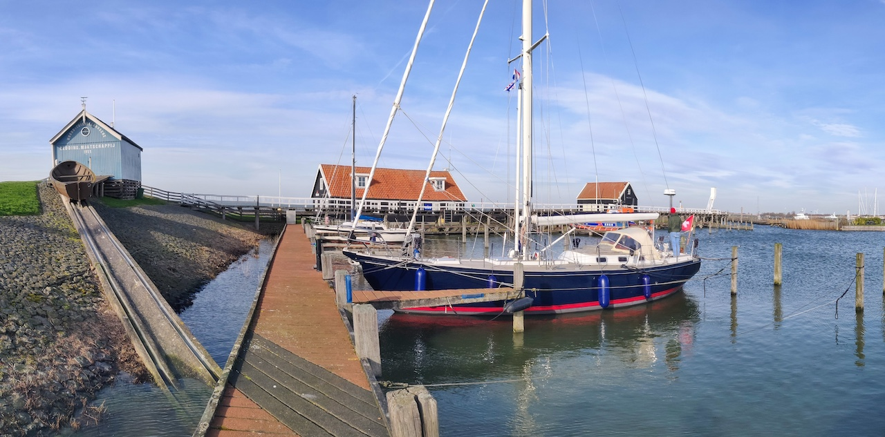
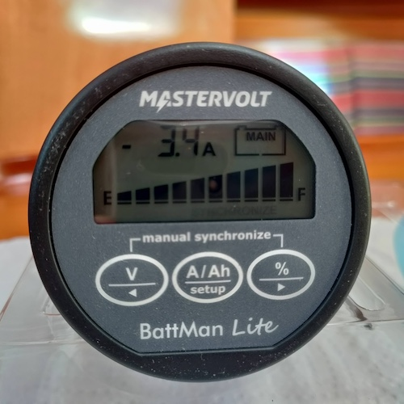
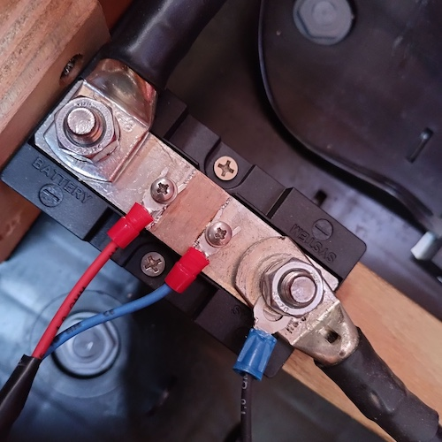

Before we bought Coelacanth, the guys from Hutting had replaced the batteries with two fresh MasterVolt AGM 12/140 Ah. Earlier, the teak deck was sanded, and the hull spraypainted. The previous owner had bought a complete Raymarine Axiom navigation system with Quantum radar.

After purchasing Coelacanth in 2021, we renewed the mainsail system blocks (Easymatic II 8:1), and replaced the sheet. The Raymarine AIS700 was reprogrammed to our ship's data by [Rimare](https://rimare.nl/) in Sneek.

<figure>

<figcaption>

Coelacanth on one of her first sailings to Hindeloopen at the IJsselmeer.

</figcaption>

</figure>

We bought new fenders (four Castro NFD-3 and two 4). We exchanged all lights for LED lights to save energy. We bought new Spinlock 6D 275N lifejackets, an EPIRB (Ocean Signal PLB1), a liferaft (Sea Master ISO 9650-1 for 4 persons), and a Besto MOB retrieval line and a MOB buoy. We installed a new radio (Fusion MS-RA70).

In 2022, the humming old transformer was renewed by a Mastervolt MASS GI 3.5 providing galvanic electrical isolation between shore power and the on board power. Also, we installed a Mastervolt Battman Lite battery monitor.

<figure>

<figcaption>

Battery monitor

</figcaption>

</figure>

<figure>

<figcaption>

Shunt

</figcaption>

</figure>

We varnished the cockpit table and the companionway, and the steering wheel got new leather from [Stuurwielleer](https://www.stuurwielleer.nl/) in Enkhuizen. The starboard yankee winch was reverted to a Anderson 58ST, where the previous owner had placed a monstrous electric winch. The toilet hoses were renewed, and the toilet pump overhauled. The Refleks heater was overhauled, and the stuck dorade vent replaced.
