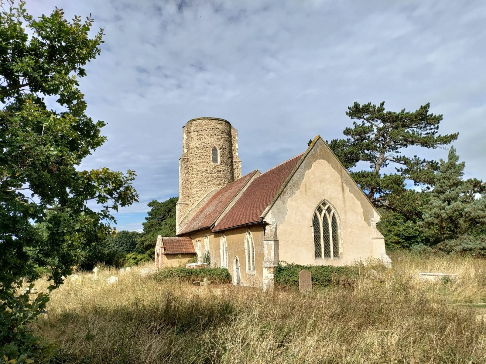
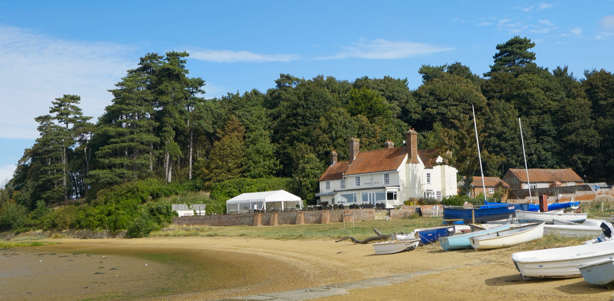
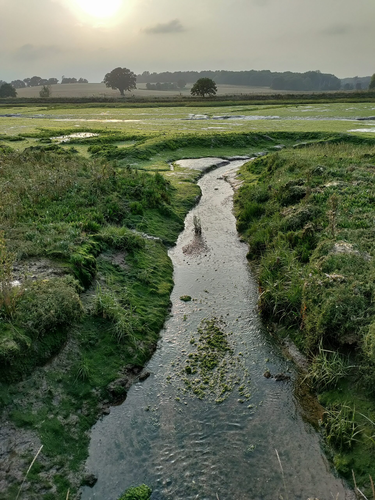
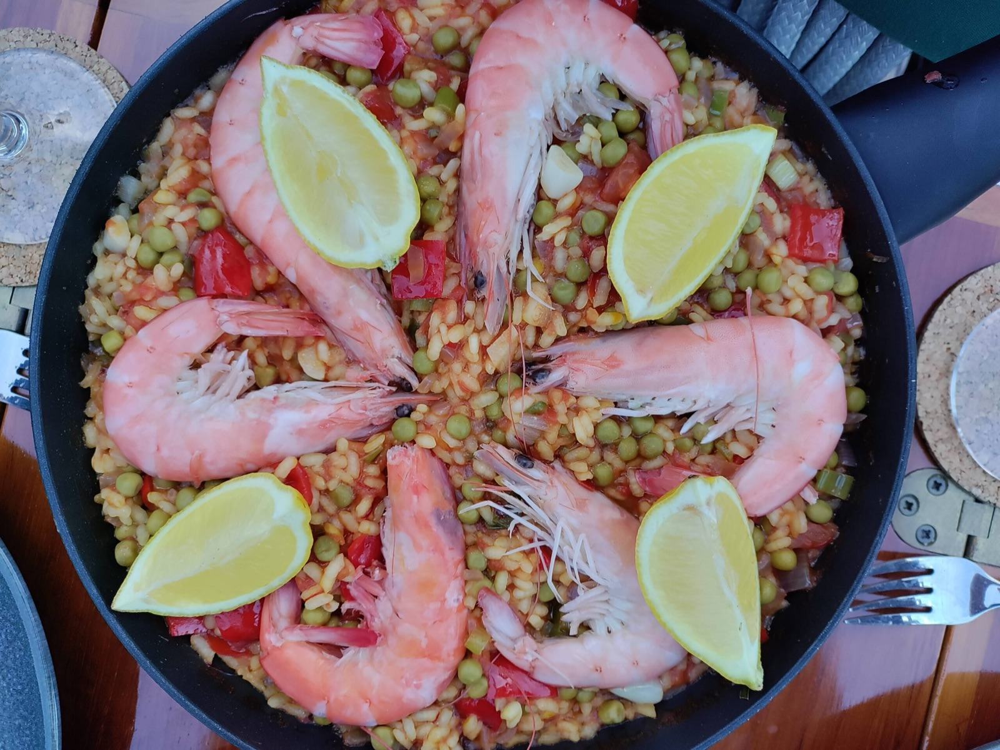

Another passage across the North Sea to the rivers of East England — and their hidden histories. This is the second of our voyages into these beautiful rivers (not counting our first North Sea crosssing to Lowestoft and back in 2022). Underway, the wind unexpectedly freshened and Coelacanth was in her element…

The forecast for the passage from the Frisian Islands to East England looked encouraging: fifteen to twenty knots of wind and a two-metre swell. We were to find out that the North Sea had other ideas. We left Den Helder's Koninklijke Marine Jachtclub – the royal yacht club founded by Dutch navy officers in 1899 – on the ebb, using the strong current of the Schulpengat to carry us seaward. Once clear of the offshore wind farm, the horizon opened up and we crossed the first of several Traffic Separation Schemes that structure this busy corner of the southwestern North Sea. Container ships slid past on their lanes, carrying unknown goods to Antwerp or Hamburg.

Under a reefed yankee, we ran downwind, the boat rolling in the swell. By evening the northeasterly wind began to build, and through the night it settled into a steady thirty to thirty-five knots, with gusts touching eight Beaufort. Undaunted, Coelacanth carried us steadily through the waves. 

To the west, the flashing sequence of the lighthouse of Southwold its appeared and marked our progress. By morning, after 132 miles, we arrived just in time for high water to enter the River Blyth. 

https://youtu.be/943MKL7XWws

In the following days, we explored the River Ore’s marshland nature reserves, entered the Deben through its narrow and shifting mouth, and reached the River Orwell — where Thames barges still sail past the container docks of Felixstowe. These rivers wind through quiet villages, tidal reedbeds, and forgotten corners of trade. They are remote, intricate, and utterly beautiful.

The return led us to IJmuiden, through the Nordzeekanaal to Amsterdam's Sixhaven and into the IJsselmeer — from fog to city lights, and back to calm.

<figure>

<figure>

<figcaption>

All Saints Church Ramsholt with its round church tower overlooking River Deben.

</figcaption>

</figure>

<figure>

<figcaption>

Ramsholt Arms at River Deben

</figcaption>

</figure>

<figure>

<figcaption>

River Orwell

</figcaption>

</figure>

<figure>

<figcaption>

Self-cooked North Sea Paella in Southwold.

</figcaption>

</figure>

</figure>
