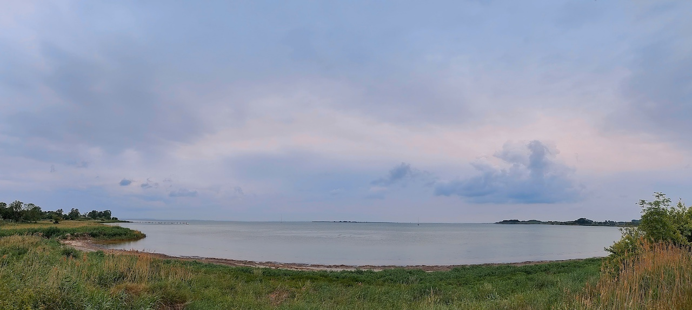
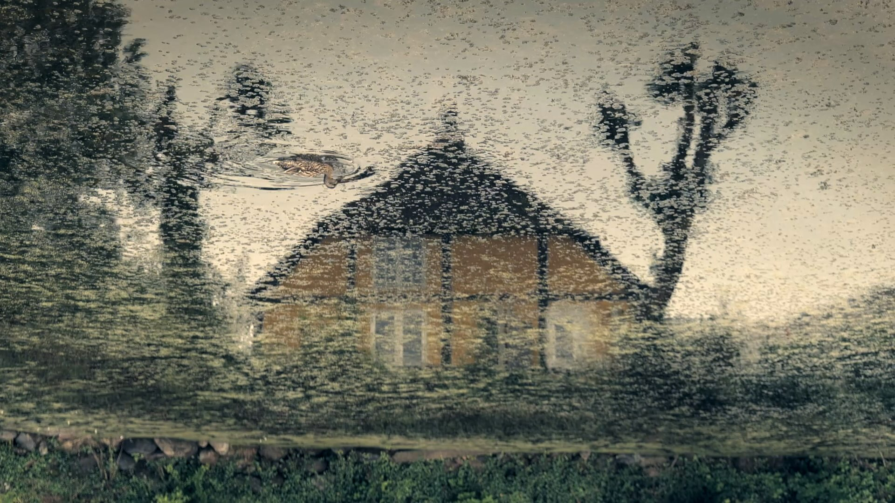
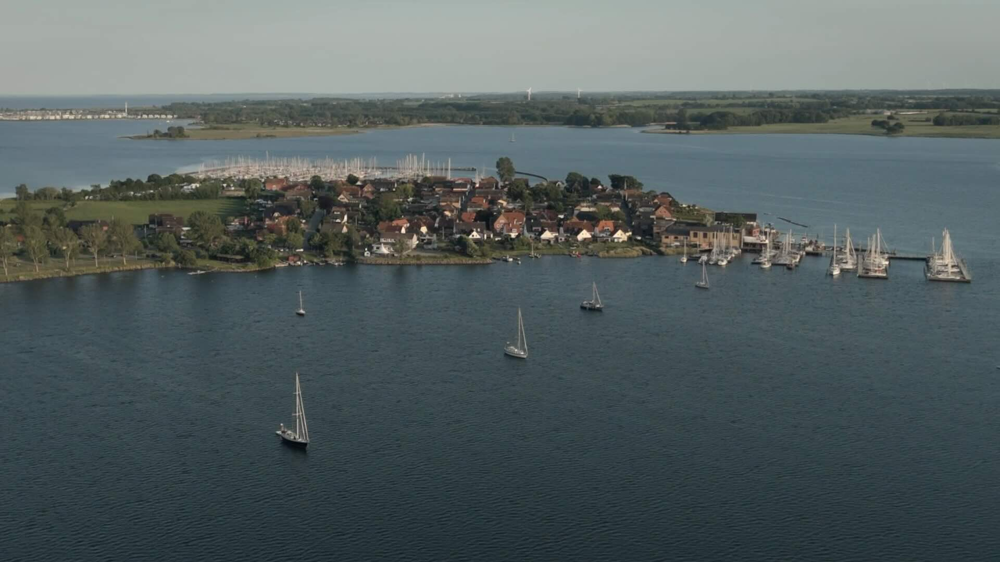
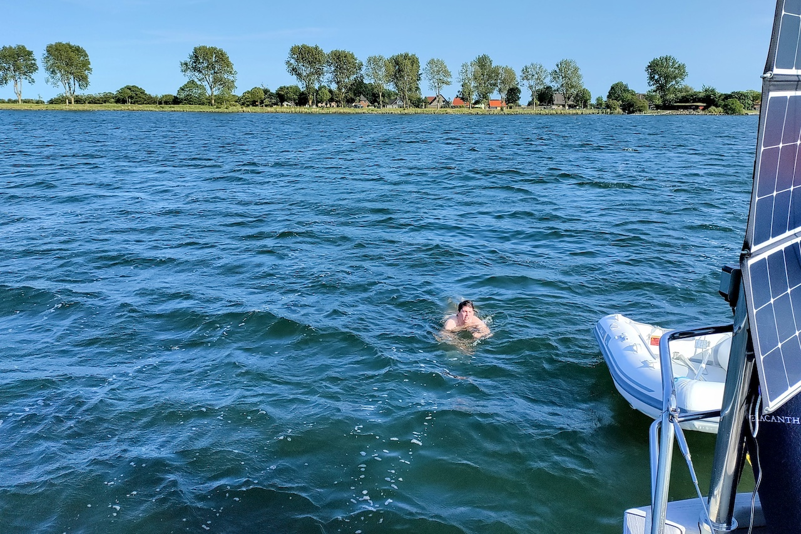

It's summer and we sail from Friesland over the North Sea into the Baltic, and cruise in the Danish isles south of Funen: Langeland, Strynø, Ærø, Drejø, and Lyø.

https://youtube.com/playlist?list=PLmGe\_gyfvhPJnklTbX4ZNoV\_lQ3fhyJi4&si=3G4OsGMx5i7SbRtA

Actually, we had planned to further explore the rivers of East England. But the winds had other plans. Forecasts announced serial low-pressure systems coming in with prevailing Southwesterlies. A crossing from Friesland to England against the wind seemed pointless. Only idiots and racers sail upwind.

So the Baltic Sea it was. A night passage along the Frisian islands into river Elbe, crossing the Kiel canal, and enjoying a week of island hopping in the Danish archipelago south of Funen. A chart was bought, and off we went.

### Along the Frisian Islands

We left Makkum with the tide, slipping through the lock of Kornwerderzand – leaving what was once the Zuiderzee. In the Golden Age, Dutch ships sailed from here to the North Sea, eastward into the Baltic to the Hanseatic cities of Lübeck, Danzig, and Riga, and the Spice route in the Far East. The winds haven’t changed much. Nor the currents.

Sailing through the lock into the Wadden Sea seems often a bit like a race for a marina space in the Wadden Islands. We briefly stopped in Vlieland, the marina was very busy because of a bank holiday. Vlieland was once the base of famous admirals Tromp and de Ruyter who dominated the seas.

When we started our journey in Vlieland in the early morning, there was a stiff breeze blowing, and undocking wasn't easy in the tight marina. At the Zeegat between Vlieland and Terschelling, the shallow banks fell away. That’s where our voyage really began. Once through the Stortemelk and outside the Wadden Sea, the North Sea opened and we sailed all night along the Frisian islands.

Finally, we reached river Elbe and began the long approach to the locks of the Kiel canal. Strangely, the tidal stream did not turn as expected and predicted, and we had a foul tide against us for most of the way. Actually, we had planned to sail only to Cuxhaven but we continued upstream the Elbe and passed the lock into the Kiel canal.

Immediately after the lock, there is a small marina surrounded by trees on one side and the locks on the other – steel, red brick construction, huge container shipes from all over the world. Once in the small marina of Brunsbüttel, we settled for the night, tired from the 36-hour passage. After the overnight passage along the Frisian islands and the long Elbe approach, sleep fell so fast and empty of dreams that the night seemed to have rushed by in only a few hours.

### The Lock Between Two Waters

When we woke, the sun was already bright. A few espressos later, and after an unhurried walk through the town, we were visited by two cheerful German customs officials. One of the officers shared, with dry amusement, tales of Germans attempting to avoid tax by flying a false Swiss flag. Some of them declare their home port to be Zurich – betraying their lack of knowledge that Basel is the only Swiss port connected to the sea via river Rhine.

We left Brunsbüttel without haste, intending to pause mid-way through the Kiel Canal. Though it can be crossed in a day if the sun permits – as pleasure boats are permitted only in daylight – we chose to stop at the lock where the old River Eider joins the canal. A hundred years before this present waterway was cut, there was an earlier route – a canal running via the Eider, with six locks rather than today’s two. In those days, when the wind failed, teams of horses towed the ships along the banks. Jules Verne and his brother travelled the canal on their steam yacht and enjoyed the idyllic landscape. Today, though greatly altered and expanded, traces of that older canal remain. At the Eider lock, we passed the night, the call of a cuckoo serenading the slow fade of light.

At first light, we cast off. The canal was quieter than expected. Ships passed in muted procession: freighters, sailboats, a French warship. We dipped our flag, but this was only met with studied indifference.

When we finally arrived at the lock in Kiel, there were a half-dozen sailboats waiting for the opening of the lock. Being used to Dutch habits, we entered as the gate opened, only to be greeted by a flurry of whistles and raised arms from a German yacht ahead. The couple within, earnest defenders of lock etiquette, viewed our manoeuvre as a breach of order. We hung back, smiling. The lock was large enough to swallow us all – and many more besides.

In “The Riddle of the Sands”, Erskine Childers described: “We … tumbled down our sails and came to under the colossal gates of the Holtenau lock. That these would open … seemed inconceivable, but open they did, with ponderous majesty and our tiny hull was lost in the womb of a lock designed to float the largest battle ships.” And so it was again. With only a gentle shift of water level beneath us, the gates drew slowly apart, revealing the shining reach of the Baltic. The Kieler Förde lay ahead, bright with wind. Sailboats gybed, daysailors waved, enjoying the wind and sun.

As we reached the lighthouse, a glimpse over the stern revealed a cloud reaching down to the sea: a squall. The sky darkened, abruptly, and the rain came in stinging gusts. Seven Beaufort, as sharp as it was brief.  
Then just as quickly, sun again.

We crossed the Kieler Bucht to enter the waters of Denmark. After about thirty miles, the Danish isles rose ahead, and we entered the harbour of Bagenkop. Just at the harbour entrance, another squall appeared and made docking difficult – a weather pattern that would repeat in the following days.

We had almost reached our destination – the Danish archipelago south of Funen: a scatter of green islands across a sea of shades of blue.

### The Danish Archipelago South of Funen

Our course took us along the low outline of Marstal – a town with centuries of sailing tradition. Marstal’s history is built on shipbuilding, crafting schooners that sailed from the Baltic to distant oceans. Generations of sailors left from here and went around the world.

The day’s weather played a familiar card: bright sun at our departure, a slow thickening of cloud as the islands drew closer, and then – as though timed to the pilotage – a sharp squall at docking in Strynø’s narrow harbour. Docking Coelacanth in crosswinds can be a bit difficult… Her long keel answers the helm like a polite but stubborn aristocratic elderly lady. But in the end, we made fast in a quiet corner of the basin and took a first swim in the cold water of the Baltic.

A front approached, and the rain came with high winds. Our space in the corner of the small harbour was unquiet, but we welcomed the pause and enjoyed the atmosphere of the small island. It was the first time since leaving Friesland that we had lingered more than one night in harbour. The rain ceased, and the wind remained – shaping waves in the meadows of Strynø as much as on the sea. The island itself is small, almost reticent. One modest grocery shop supplied our needs. At the church, a list of pastors since the 16th century fits on just two wooden boards.

<figure>

<figcaption>

Strynø

</figcaption>

</figure>

We left Strynø and sailed through a narrow fairway between tiny islands and then fell off towards Ærø. Sailing through these narrow fairways, among low islands and scattered sand, you consider how landscape shapes seeing and listening. Sparse land, wide skies, clouds remaining undisturbed from ground turbulence. Subtle changes, a shift in water colour, a line of reeds. A belfry behind low trees. [A landscape of suspended chords](https://coelacanth.ch/dutch-landscapes/) with fragments of melody. Harmonies resisting resolution.

We dropped anchor in a large bay. It bit at once. We inflated the dinghy and went ashore – a low pier of weathered wood, past fields and houses with thick thatch and whitewashed walls. Damp from drizzle, we returned to Coelacanth and the comfort of the diesel heater. The yellow flames and a cup of tea drew the night in close.

At two in the morning, I woke to a sound – a dull knock or scrape. I opened the hatch and leaned out into the still air. The anchor chain lay quiet. It was the halyards inside the mast, swaying gently. The moon was near full, silvering the water. I slept again.

Morning came soon enough. We weighed anchor and shaped course for Drejø, the next small isle in this scatter of land. The dinghy trailed behind us, and we sailed slowly through rain, reading the shallows, and turning at the cardinal buoy.

The island was quiet. We wandered along the shoreline, the rain trailing off in mist. In the evening, the sky cleared, painting the harbour building deep Danish red in the level sun. And then – as if someone had indeed flicked a switch – the wind rose at last. The promised gale arrived.

<figure>

<figcaption>

Coelacanth anchoring in Ærø.

</figcaption>

</figure>

The sail to Lyø was the first upwind course since we had left Friesland. The wind blew with force five from West by Northwest. Tack after tack, we worked our way against the fresh breeze – we passed Ærø, then Korshavn and the shores of Avernakø. We had to find a sheltered anchorage for the night.

Behind gently curved cliffs, we entered the fjord of Faaborg. The fairway wound between banks and shallows. At the end of the bight, we dropped the hook. The anchor set at once again. We lunched aboard and discussed the spot: would it provide a quiet night? The water seemed restless, the wind had not yet listened to the forecast. Finally, a decision was taken – we would sail on to Lyø and its harbour.

<figure>

<figcaption>

Lyø

</figcaption>

</figure>

At Lyø’s grocery store, we met our neighbours from the sailboat next to us replenishing their beer supplies. We did laundry but drying was hopeless in the steady rain. Nevertheless, we explored the island with its old farmhouses with thatched roofs, green ponds, and trees rustling in the wind.

A rest of the rainy day in Lyø was spent under deck reading and taking advantage of a short hour without downpour to explore the island and replenish provisions at a grocery selling the most needed goods. After a week sailing between the isles in blue and turquoise waters, it was time to think of the way back – through the Small Belt, towards Kiel, and back home into the North Sea.

### Decision at the Lock

We were leaving the Danish archipelago behind. Low islands, quiet anchorages, small harbours where time seemed to slow. Now, the course was set west – toward the North Sea. On our way back to the Netherlands, the first leg led us from Lyø to Kiel.

The day was sunny, the air dry with the wind from the northwest. Under the eyes of our German neighbours, we left the narrow harbour of Lyø. Coelacanth behaved unexpectedly elegant swimming backwards in the crosswinds, which is not always the case, particularly if there is an audience.

We tacked our way north to round the island, and then fell off in the Small Belt. The yankee sail took over from the jib. We were running downwind with Beaufort force four to five in blistering speed rarely dropping below eight knots. How easy is sailing when there is fair wind, no tidal currents to plan, and neither freighter traffic nor a TSS to cross!

After a few hours, sailing from Denmark to Germany, we arrived at the mouth of the Schlei known for silting and shallow water. We passed the lighthouse on the lonely Lotseninsel with that thirsty pilot that Erskine Childers described so well. We didn’t want to hunt ducks but were rather looking for an anchor spot in what he called “this enchanting corner of the world”.

<figure>

<figcaption>

Coelacanth anchoring in the Schlei at Maasholm.

</figcaption>

</figure>

In a bay near the village Maasholm, we dropped the anchor in two metres of water. Thousand years ago, the Schlei and the Eider formed a link between North Sea and Baltic. Vikings settled in Hedeby and controlled the passage over the isthmus, moving goods and ships between two seas. One of Hans Christian Andersen’s fairy tales describes ships and trade, but also the shadows of violence, and layers of history lying under a quiet landscape: “the waters lie sleepily hidden among green reeds, and the brown marshy banks look as if they wished to conceal themselves.”

The weather forecast promised a quiet night. At nine o’clock sharp – exactly as forecasted – the wind dropped from Beaufort five to three, then two. Nevertheless, our French neighbour boat dragged her anchor and nearly stranded between the trees at the shore. After a swim in the cold water, we enjoyed dinner in the cockpit and let the day pass in memory. Then we turned in for a good night of sleep.

<figure>

<figcaption>

Anchoring in Maasholm.

</figcaption>

</figure>

The next day, we visited the village for a cup of coffee and bought fresh bread – the dark, dense variety you get in Germany. We would be glad of that bread later on our journey.

The day was sunny again. The wind came from the east at Beaufort four to five – ideal conditions for the leg from Maasholm to Kiel. We passed a German navy ship and soon reached the lighthouse that marks the entrance of the Kieler Förde. Planing dinghies criss-crossed our course, traditional sailings ships passed, and the occasional freighter moved slowly ahead to the Kiel canal.

We moored at the jetty in Holtenau, just next to the lock into the Kiel canal. We had an appointment to keep: a meeting with the designer of our windvane, to collect missing parts for our self-steering. The parts were collected, several anecdotes, too.

A look at the wind forecast confirmed: there was only a short weather window to sail westward. The small high-pressure area would soon be gone. And we still had the Kiel canal to cross: 53 miles of motoring. After living easy in the Baltic, the need for planning when to sail was back.

It was time to make a decision: would we make it to the North Sea to catch the easterly winds forecast to last perhaps 48 hours at best? Could we pass the canal in time for the strong tide of river Elbe flowing into the North Sea? After that, it would be headwinds for a week. And only racers and idiots sail upwind.

### Back in Tide

We were at the lock of the Kiel canal, and the North Sea offered only a narrow weather window: easterly winds for 24 hours. After that, the forecast shifted – back to headwinds and, perhaps, thunderstorms, then no wind.

We took the narrow opportunity. We cast off, and were placed by the lockkeeper astern of a cargo vessel laden with timber – a fitting echo of older trade: wood from the Baltic bound for the North Sea.

As an alternative to the Kiel canal, we had considered the River Eider, which joins the Kiel Canal at Gieselau – a route used less now, but still navigable. It promised a slower, quieter journey through meadows and past mills. But there were questions: bridges that might not open, silting banks, the risk of running aground, or becoming slowed by tides. We were simply running out of time.

Then came the canal: 53 miles of still water, one long corridor of green and sky. The sun held. The day passed in low engine hum and drifting thought. Ten hours later, we entered the lock at Brunsbüttel. The timber ships, our travelling companion from gate to gate, left quickly – no longer bound by canal speed restrictions. We followed more slowly, letting the Elbe carry us downstream.

The sun was low when we reached Cuxhaven. Now came the difficult part: the long approach through the Elbe and out into the night. The tidal current of the Elbe is complex: when the Wadden Sea is already flooding, the Elbe still streams outward strongly. Somewhere near Scharhörn, the forces meet and the clash can be quite unpleasant when the wind takes part in the meeting. There was no time for proper tidal planning – we just had to go, as the wind would soon turn against us.

We split the night into watches: three hours on, three hours off. Handover at 0200. Halfway out the Elbe, we met the tides in force. The current held against us. Large container ships passed close – one cable’s length away – their bow waves steep, and Coelacanth danced over their wake.

Then something stranger: a low thudding, rhythmic and deep. For a moment I thought I was imagining it – until the lights came into view. A cruise ship, illuminated like a musical stage, slid past to starboard. Its music rolled over the water in thumping pulses. Moments later, we heard the cruise ship captain call Elbe Traffic on VHF. There was a medical emergency aboard – a broken arm. A helicopter was en route. Soon the aircraft appeared, circled, and winched the casualty up and away into the night.

Round midnight, the moon rose – red and full – over the stern. The wind had increased: a strong easterly, as forecast. We set course: 250° – Spiekeroog, then Norderney off the beam. We were sailing along the Frisian islands once again, but now in reverse. At Borkum, the wind dropped. For an hour, there was nothing – not a breath. The sea flattened. The sails flapped. Coelacanth was not amused.

Then, without warning, a flock of birds appeared – spiralling low over the mast. They circled twice, then made for us directly, legs stretched out. Not seabirds – but doves, marked with leg rings. Exhausted, they landed – awkward, slipping against the mainsail. One staggered back towards the cockpit, he seemed to be asking for refreshments. We gave them both water and crumbs. They rested. And after a time, they left.

The wind faintly returned. But now from the south, veering southwest, as predicted. Another night at sea, heading into low winds, had lost its appeal. On the horizon, towers of cumulus rose like monuments. We tracked them on radar – they moved away from us, but left a low roar of thunder behind.

We altered course, turned toward the Wadden Sea, and aimed for Lauwersoog. There we would enter the canals – the same inland routes that once carried Baltic cargo to remote rural villages. At Engelsmanplaat, we passed a fleet of flat-bottomed traditional dutch sailboats – platbodems – falling dry on the sand at ebb. The tide had them, still and patient.

We reached Lauwersoog at sunset. It had been 36 hours since we left Kiel. 180 miles from the Baltic to the Wadden Sea. We drank a quiet beer and slept for ten hours without dreams.

### Blue to Green

The next day, we entered the Robbengatsluis – the gate into the Lauwersmeer. The lock was busy with weekenders. We were number four in line to enter the lock at port side, the energetic lock keeper told us after asking for length and width of Coelacanth. She assessed the first half-dozen boats at a glance, arranged them mentally like pieces in a tray, and waved us in accordingly. Within moments, the gates were closed.

Out of the lock, the Lauwersmeer opened ahead – wind-creased and pale green bordered with reeds. The Lauwerszee was formed by a flood in 1280 and many plans were made to shut it off from the Wadden Sea. But only the disastrous flood of 1953 led to the separation of the Lauwersmeer by dikes and the construction of a lock and the new harbour of the village Lauwersoog in 1969.

The Staande Mast Route runs through the whole of the Netherlands – from Delfzijl at the Ems to Breskens in Zeeland. For centuries, grain from the Baltic, timber from Riga, tar and hemp moved west along these waterways. Frisian boats carried cargo inland, linking the North Sea with Holland’s cities. Besides, these canals also form the route of a famous ice skating race (Elfstedentocht) – almost 200 kilometres along the eleven historic Frisian cities.

The oldest canals of the Netherlands are over thousand years old and served water drainage, but also transport of goods in small boats. The vast network of canals connecting rivers, towns, and seas, however, goes back to the Golden Age in the 17th century. In Friesland, these quiet waterways once carried trade, using flat-bottomed boats that could pass under low bridges and through narrow locks. The Tjalk ships – Skûtsjes in Friesland – were the workhorses of inland waterway transport in the 18th and 19th century. The captain and his family lived onboard. These gaff-rigged sailboats measured 12 to 20 metres and had a foldable mast.

We turned into the soft water among the meadows, and the world shifted: the blues we had come from gave way to greens. The wind moved the reeds at the canals, birds sung, the clouds raced. Later, past another small lock and a lifting bridge, we moored for the night. The place was simple, quiet – a wooden jetty in open pasture, with a village belfry on the horizon, birds calling across the flat distance. Clouds drifted over the green landscape.

<figure>

<figcaption>

In the Frisian canals near Ee.

</figcaption>

</figure>

We continued to Dokkum and moored between two windmills at the canal where in the 16th century the walls protected the hexagonal centre of the town. In those times, Dokkum was the centre for trade with Spain. In the evening, the harbourmaster came along to get the mooring fee, and in the morning the garbage was collected from the ship right away.

In Leeuwarden, we moored in the park in the centre of the town. Coelacanth got many compliments of passers-by. The capital of Friesland has an impressive book shop, and many cafes and bars to sit along the grachten and enjoy a glass.

Then came the canal connecting to Harlingen that is used for commercial shipping. We continued through Harlingen’s lock to reach the Wadden Sea. The lock is named after Tjerk Hiddes de Vries, one of the famous Frisian admirals of the 17th century, who fought in the Anglo-Dutch battle of Lowestoft. In the Wadden Sea, we had a last chance to set our sails to get back to the busy Lorentzsluis into the IIsselmeer and back to Makkum.

On our three-week trip, we sailed 550 miles. We traced the old trading route from Friesland to the Baltic Sea – making use of the modern way through the Kiel canal crossing freighters from all the world. We sailed to tiny Danish islands where we were often the only visiting yacht. Once back in the North Sea, the tidal streams and sands once again set the course. In the Frisian network of canals, we retraced the distribution of goods coming from the Baltic into Friesland and into mainland Europe. The trip was not only an exploration of a new cruising area – the Baltic – but also a voyage into the past of seafaring.
