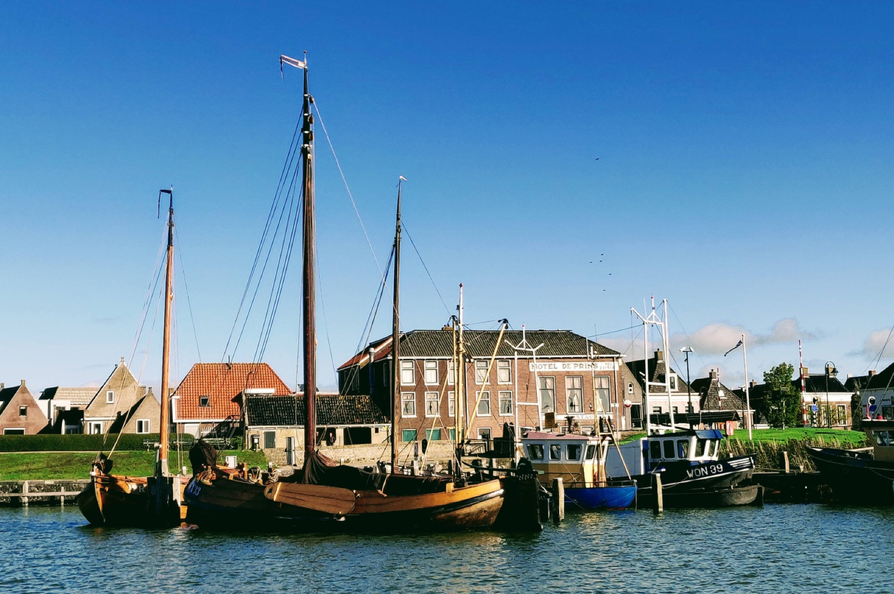
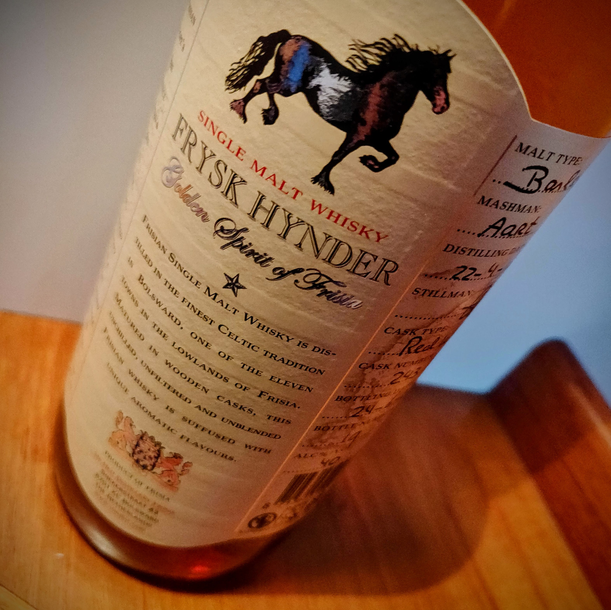
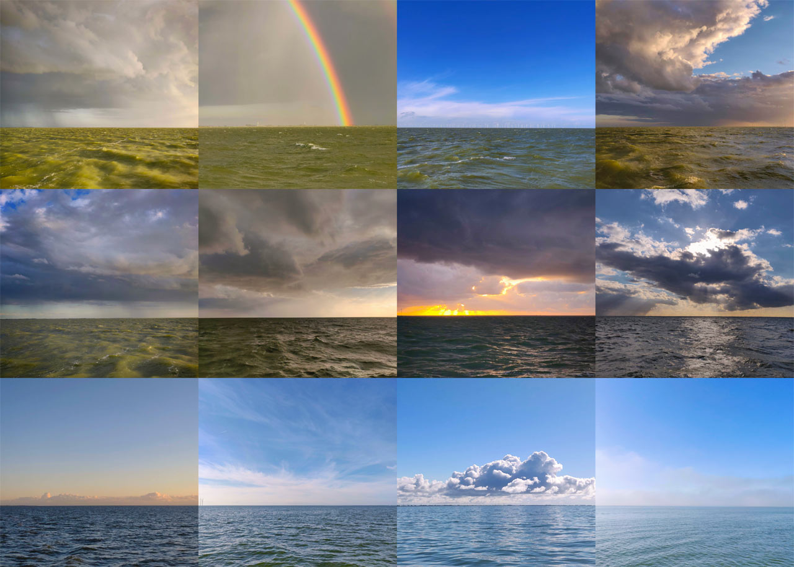

_Coelacanth_ is a Hutting 40, a full-keeler built in 2001 by Frisian [Hutting Yachts](http://www.hutting-yachts.com/). Her hull is aluminium with a length of 12.1 m, width 3.6 m, and draught 1.6 m. Displacement 13.4 tons, half of it being cast-in lead ballast. She’s cutter-rigged with a 16 metre mast, main sail 42 m2, yankee 39 m2, and stay sail 16 m2. The engine is a Yanmar 4JH2-TE with 63 hp fed by a 500 litre diesel tank. Behind these dry figures lies a yacht with character. Here is the story of becoming her sailors.

<figure>

<figcaption>
Lifted from the water, Coeloacanth is undergoing a survey.
</figcaption>

</figure>

Twenty years ago, it seemed impossible to ever have a sailboat on my own. Yet, I studied sailing yachts for years. I received Hallberg Rassy's newsletter year after year. I studied Rustler, Najad, Ovni, Allures and Garcia, RM, and many more, even Bénéteau, Bavaria and Hanse when I despaired.

Then I saw the Hutting 40. I fell in love with the sleek lines of the hull and the strong yet elegant rig designed for high winds. A full-keeler that remained unaffected by the trend in yacht building towards ever wider sterns and double steering wheels, she was something of a fossil. Some things remain unchanged for good reason.

My enquiry at Hutting remained without success, the pandemic had dried out the used boat market. However, a few weeks later in early spring 2021, Hutting Yachts contacted me. There was a Hutting 40 coming home to Makkum from the Canaries to be sold.

What a fitting name _Coelacanth_ was, she was waiting just for us! Her name _Coelacanth_ goes back to the 400-million-year-old “living fossil” fish thought to be extinct, but rediscovered off the coast of South Africa in 1938. The first owner of _Coelacanth_ was a diver like ourselves, and he must have been as enthusiastic about this creature, which seemed to have survived Darwin's theory of evolution unscathed. South African diver Peter Timm had observed the fish in 2010 off Sodwana, and the 2013 [Gombessa expedition](https://gombessa-expeditions.com/en/meet-the-coelacanth-in-south-africa/) of French photographer Laurent Ballesta excited us keen amateur divers.

<figure>

<figcaption>
Makkum, home of Hutting Yachts in Friesland.
</figcaption>
</figure>

<figure>

<figcaption>
The first week sailing Coelacanth on the IJsselmeer
</figcaption>
</figure>

<figure>

<figcaption>
A gift from Tjerk.
</figcaption>
</figure>

The pandemic made travelling difficult, and so it was summer when we were finally able to drive to Makkum to see _Coelacanth_. What a ship! Everything was rock solid from the teak deck to the salon. And what a beauty!

However, the drama of becoming her owner took another twist – and maybe needed the intervention of Felicitas over Fortuna. Another interested party had just made a bid that got accepted. Disappointed we left Makkum for La Rochelle for summer holidays. Two weeks later, Tjerk Hutting contacted me to offer _Coelacanth_ again, as the original buyers had cancelled their bid. _Coelacanth_ became our ship as she was meant to be. Tjerk Hutting made it clear that his ships would still be sailing in a hundred years' time. _Coelacanth_ would outlive us all. We would just be her sailors.

<figure>

<figcaption>
The colours of the IJsselmeer.
</figcaption>
</figure>

We anxiously asked for a skipper instructor who could show us the Frisian waters, which commanded enormous respect from us as Swiss freshwater sailors. Paul, a retired transplant surgeon from a Dutch university hospital, was an old hand with decades of sailing experience. He owned the sister ship of Coelacanth, a Hutting 40 with a construction number one digit lower. Paul spent a week sailing with us in Dutch waters, instructing us in sailing manoeuvres and explaing the secret inner workings of a Hutting 40.

Now we were to sail _Coelacanth_ on our own!
