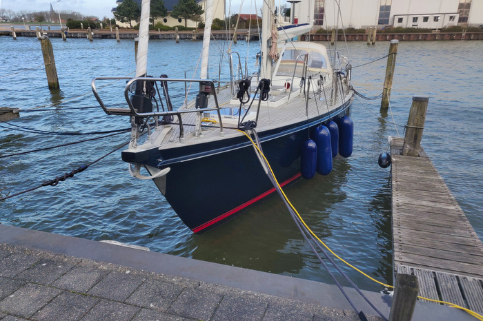
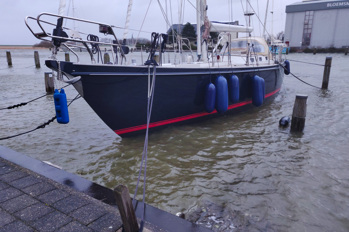
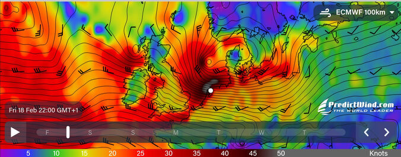

A few months after buying Coelacanth, and being still very unexperienced, we ventured out on a winter round trip around the IJsselmeer. We just had spent a lively night in Makkum during storm Ylenia before leaving, and an IJsselmeer-circuit was an adventure to us.

A few days later – we had sailed to Hindeloopen, Medemblik, and Enkhuizen – the predictions warned from a storm approaching via Ireland to the Frisian coast. We decided to sail back to Makkum, and the wind already made for a sporty ride. We holed up behind Hutting's shipyard, protected from the expected southwesterly wind.

The barometer fell by 8 hPa in six hours. We added more mooring lines and continuously had to adjust them as the water level surged. The IJsselmeer is non-tidal, but the wind pressed all the water into the northeastern corner. Only by use of a fender ladder at the bow was it possible to enter Coelacanth.

A code red weather warning flashed on our phones. When storm Eunice (or Zeynep, as it was called in Germany) finally arrived in the afternoon of the 18th February 2022, the wind howled in the mast with 45 knots (Beaufort 9) gusting up to 65 knots (force 12).

In England, hurricane-force winds set a new record for the fastest wind gust. The storm left thousands of people without power in several countries in Europe, and there were multiple fatalities.

