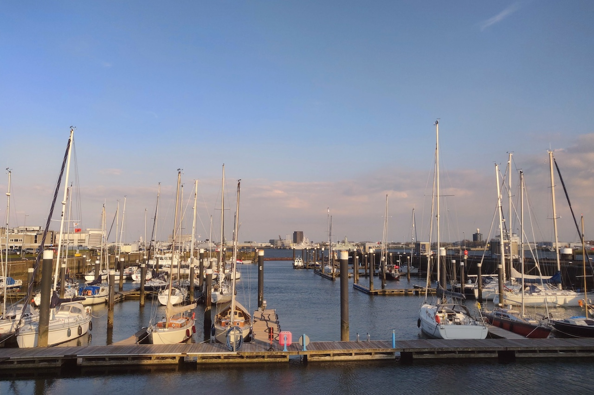
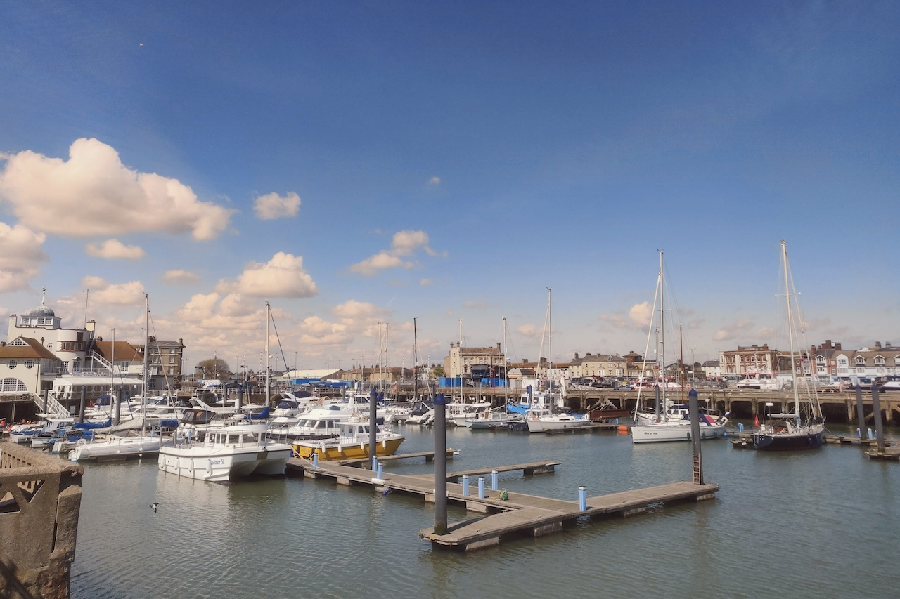
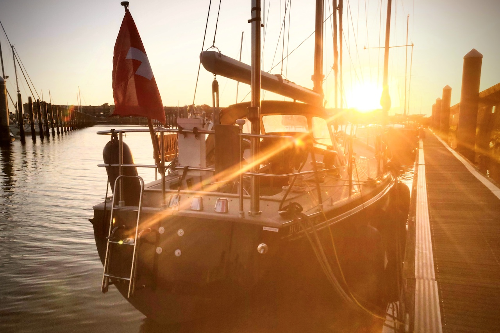

Our first North Sea crossing – from Den Helder to Lowestoft and back to IJmuiden and Amsterdam.

The northeasterly wind force 6 made for a rolly sailing from Den Helder's Koninklijke Marine Jacht Club over the North Sea to England. It was a cold night in April! Arriving in Lowestoft's Royal Norfolk & Suffolk Yacht Club, we were already expected by Border Force and Police, a detachment with officers in training. They kindly assisted with our mooring lines, and there was no objection to the slightly deteriorated aspect of one of our passports (gnawed by his dog). We had a full English breakfast in town, and fish & chips for dinner.

The next day, we left with the tide for IJmuiden. Again, Dutch customs awaited us. They suspected diesel smuggling – not surprising in view of our swift trip back and fore. They even took a sample from our diesel tank to see if it was red. We passed Amsterdam and had Indian dinner in Enkhuizen before returning to Makkum.

<figure>

<figcaption>

Den Helder

</figcaption>

</figure>

<figure>

<figcaption>

Lowestoft

</figcaption>

</figure>

<figure>

<figcaption>

IJmuiden

</figcaption>

</figure>
