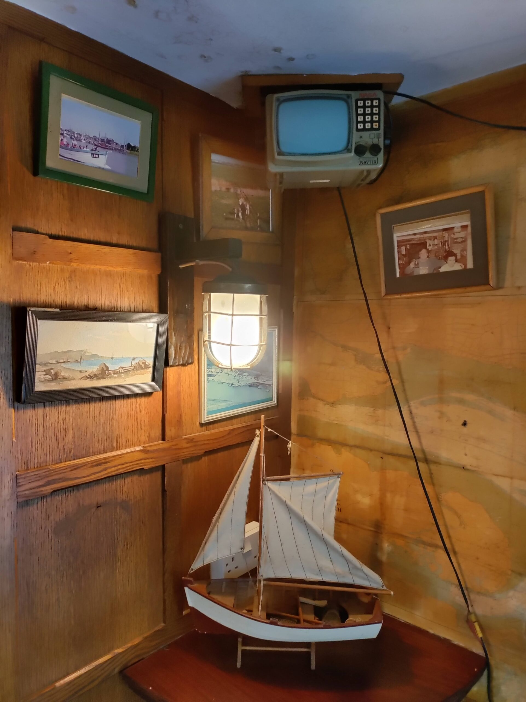
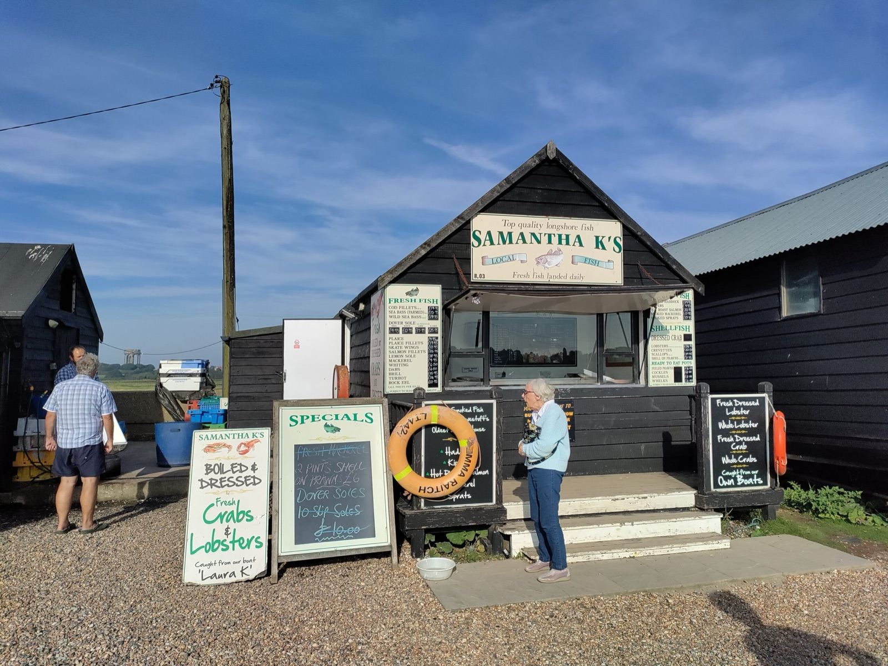
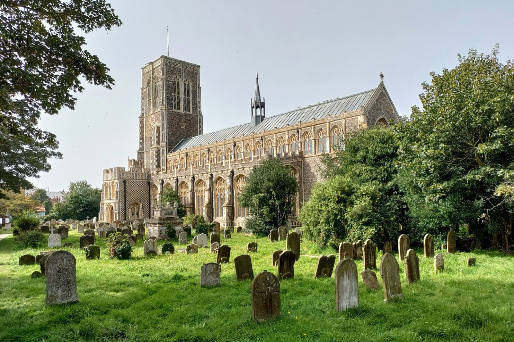
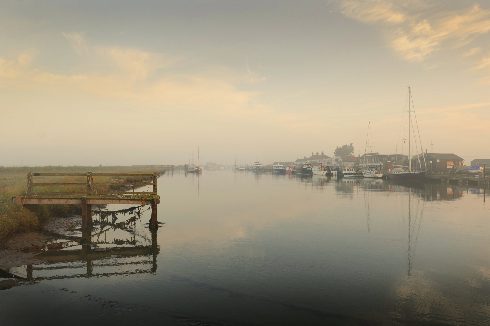

import YouTube from '../../components/YouTube.astro';

In September 2023, we sailed Coelacanth from the West Frisian island of Texel to England's East Coast.

<YouTube url="https://youtu.be/4mnYeREf3jo" />

After a night in Lowestoft, we sailed into the River Blyth and moored in the town of Southwold — with its working fishing boats, pub at the landing dock, 15th-century church, and lighthouse shining over the bar. From there we continued southward to the River Orwell, past the marshes and into Pin Mill, where the historic Butt & Oyster pub sits beneath the trees. We lingered at Shotley and Woolverstone before sailing home across a quieter North Sea.

<figure>

<figcaption>

In the pub in Southwold.

</figcaption>

</figure>

<figure>

<figcaption>

Fresh lobster, Southwold

</figcaption>

</figure>

<figure>

<figcaption>

St Edmund's Church, Southwold

</figcaption>

</figure>

<figure>

<figcaption>

Morning in Southwold

</figcaption>

</figure>
