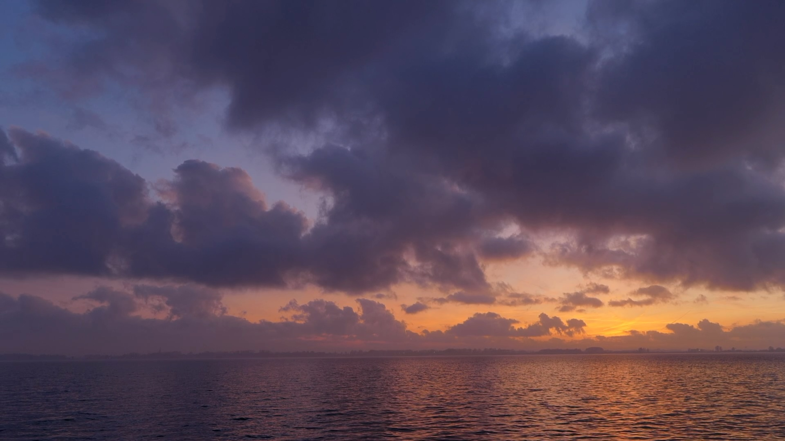
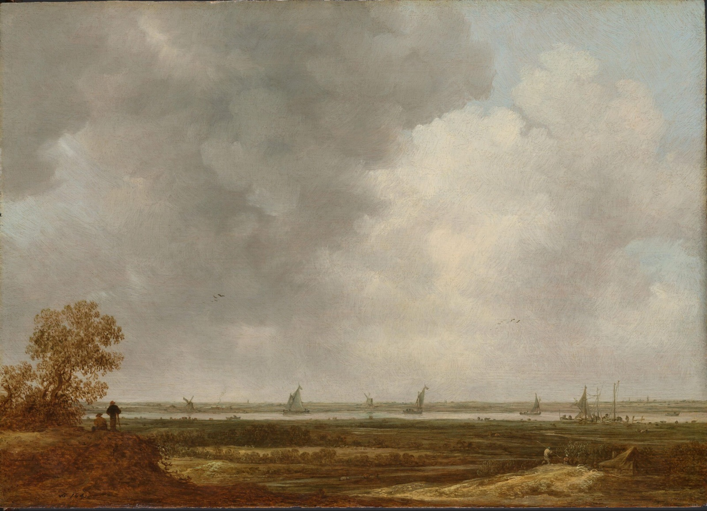
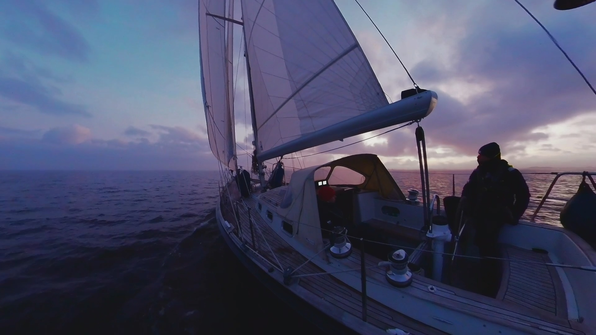

On a picturesque late autumn evening, we were just about to reach Enkhuizen – a charming village in the south-western corner of the IJsselmeer. As darkness fell, only a sliver of remaining light painted the towering clouds above the horizon in a gentle shade of purple. From the old town nearby, church bells carried a familiar melody across the dark water. Wet and cold from a few showers earlier, we were looking forward to dinner and a warming fire.

<figure>

<figcaption>

The sun sets over the IJsselmeer near Enkhuizen.

</figcaption>

</figure>

After we had finished mooring the boat, we hurried through the narrow and dark streets to get a table at a small Indian restaurant. The spicy food would warm us up after a day of sailing. Now, in late autumn, there were hardly any sailors left in the city, which is overrun by sailors in the summer months. It almost felt as if a character out of a novel by Maarten 't Hart could step around the shady and foggy corners of one of the medieval buildings at any moment, humming a chorale on his way to the church.

The next day, we took the train to Amsterdam. Idyllic pastures stretching to the horizon passed by the window. Protagonists of the scenery were – apart from a few cows and polders – the clouds, taking on ever-changing shapes and colours. Little seems to have changed since the paintings of Dutch masters like Jan van Goyen in the 17th century which we admired in the Rijksmuseum. In van Goyen’s paintings, the clouds often occupying most of the canvas do not appear as solid forms, but as blurred and transient phenomena that hint at a more comprehensive whole of nature. It is one of history's coincidences, that Baruch de Spinoza – the philosopher of an all-encompassing unity of nature – rented a house in The Hague owned by van Goyen, 15 years after the latter's death.

Centuries later, during the Romantic period, landscapes were valued for the way they gently guided the viewer’s imagination without confining it. Painted meadows and rivers could evoke memories, ideas, or emotions without prescribing a fixed meaning – a kind of „music for the eyes“. Freed from motifs with universally agreed symbolism, the mind was allowed to wander through these landscapes, much like a sailor letting his thoughts move freely while passing through open seascapes.

<figure>

<figcaption>

Jan van Goyen: Panoramic View of a River with Low-lying Meadows (ca. 1644), Rijksmuseum Amsterdam.

</figcaption>

</figure>

As a sailor in the Netherlands, it is easy to understand why Dutch painters were fascinated by landscape and abandoned the traditional foregrounds. Just as storm tides find no barriers in the flat land of the Rhine delta, so are the clouds drifting in effortlessly from the North Sea. The colour gradient from blue to a pale pink just above the horizon is never to be seen in other countries where mountains block the view.

In van Goyen’s times, landscape paintings by less famous artists were affordable even for workers and must have hung in almost every living room. Numerous neologisms of the time (for example "Graauwtjes", meaning grey seascapes) prove that landscape painting is deeply rooted in everyday Dutch life ever since. Sailing in the Dutch waters makes this long tradition of landscape tangible. The shifting sandbanks of the Wadden Sea, the vastness of the sky and the ever-changing light form a landscape that is always in motion, never fully contained – just as van Goyen‘s clouds or Spinoza‘s unity of all things.

<figure>

<figcaption>

Sailing on the IJsselmeer.

</figcaption>

</figure>
