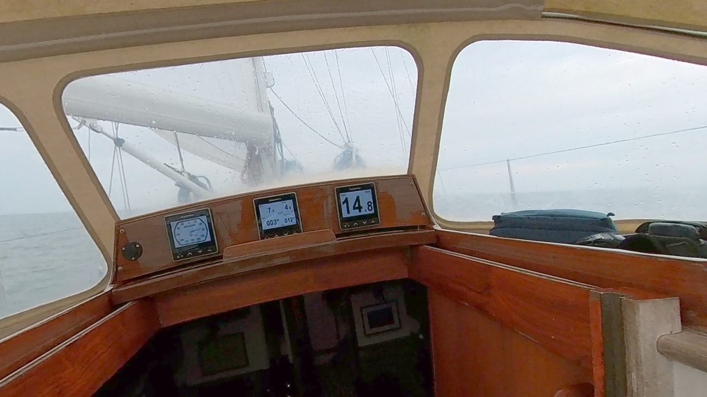

2023 work included new standing rigging that was built by [A+ Rigging](https://www.aplusrigging.nl/) in Medemblik. [De Vries](https://www.devriessails.nl/) in Makkum sewed a new sprayhood.

<figure>

<figcaption>

Old and new sprayhood.

</figcaption>

</figure>

The companionway and hatch were freshly varnished by [Hutting](https://www.hutting-yachts.com/). The instruments panel in the cockpit was beautifully renewed with an additional third Raymarine i70s instead of the old instruments. The cockpit looks much cleaner now with less plastic. Also at the card table, all the old instruments (B&G Hydra 2000 and Furuno GPS) were explanted to simplify the Raymarine Axiom system. I've connected the depth and speed sensor to the navigation system, and the cable salad gave me some problems, but I found the necessary [Airmar sensor connections](https://www.airmar.com/xref.html) information.

The guys from Hutting also replaced the refrigerator (Webasto Isotherm classic compact 100L) as the old compressor was getting hot. The old Refleks heater was replaced by a Dickinson Newport diesel heater. It had been too much trouble trying to get the Refleks running: one of us had to stand outside to shield the chimney with an umbrella from the wind while the other tried to light the diesel in the heater – which caused much grief in winter. An overhaul of the Webasto heating was not possible either, so a new EVO40 air heater was installed. In the engine department, the propshaft seal was overhauled.

A Steiner Navigator binocular was added and a RescueMe AIS-MOB1 for safety.

<figure>

<figure>

<figcaption>

New instrument panel.

</figcaption>

</figure>

<figure>

<figcaption>

Old instruments in the cockpit.

</figcaption>

</figure>

</figure>
