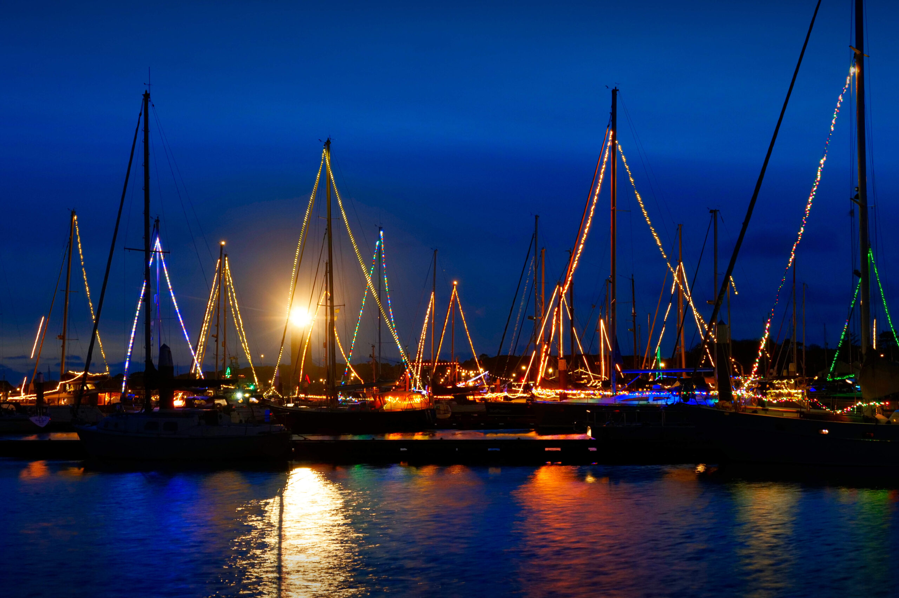
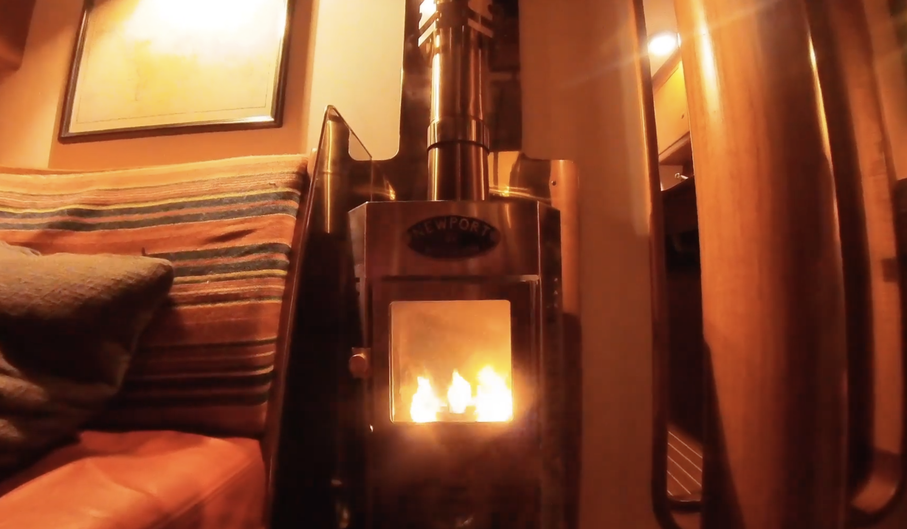

It's a tradition to sail to the Frisian island of Terschelling over the days between Christams and New Year. Winter storms howl over the North Sea. The ships present extensive festive lights, and when the year ends, the horns of the big ships welcome the new year sounding all over the place.

<figure>

<figcaption>

Waddenhaven Terschelling at Christmas, 2023. The oldest lighthouse of the Netherlands, Brandaris, flashes his light since 1594.

</figcaption>

</figure>

I played around with a simple wire antenna in the mast to receive short-wave transmissions of weather data using a USB dongle on the Mac ([RTL-SDR V4](https://www.rtl-sdr.com/v4/) with [SDR++](https://github.com/AlexandreRouma/SDRPlusPlus) or [fldigi](https://sourceforge.net/projects/fldigi/files/fldigi/) software). The received weather charts – for example the transmissions from [DWD Pinneberg](https://www.dwd.de/DE/fachnutzer/schifffahrt/funkausstrahlung/_functions/DownloadBox/Download_Box.html) or weatherfax from [Northwood](https://weatherfax.com/gya-northwood/) – look quite nice, even an ice chart of the Gulf of Bothnia…

Later, I built a simple 1:9 balun box with two 10 metre antenna wires that are connected by a coaxial cable to the RTL-SDR. A future project could be to program automated receiving of weather data transmissions on a Raspberry Pi decoding the RTTY (e.g. DWD transmissions on 7.646 MHz) and saving it as a text file with timestamp.

<figure>

<figcaption>

Winter storm in Terschelling.

</figcaption>

</figure>

<figure>

<figcaption>

The cozy heat of the Dickinson Newport diesel heater.

</figcaption>

</figure>

<figure>

<figcaption>

Ice chart received by short-wave radio.

</figcaption>

</figure>

<figure>

<figcaption>

Weather chart received by short-wave radio and a simple wire antenna in the mast.

</figcaption>

</figure>
