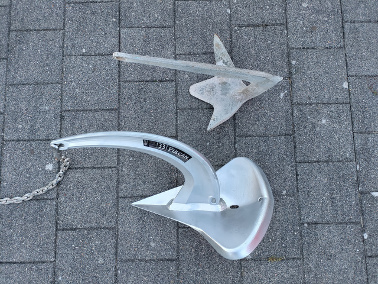
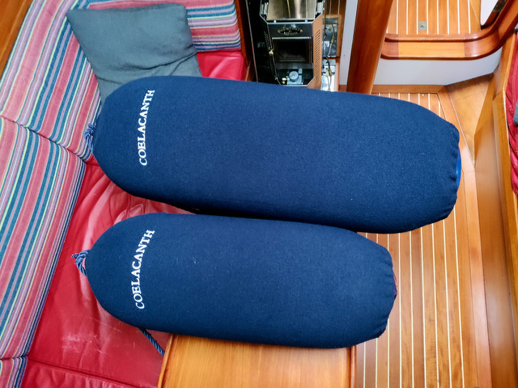

import Gallery from '../../components/Gallery.astro';

In 2024, we concentrated on improving our anchoring gear. A new anchor (Rocna Vulcan 33 kg) replaced the old Bruce anchor. A dinghy was bought (ZAR mini Air 8) with an electric outboarder (Epropulsion Spirit 1.0 Plus). We did not have too much opportunities to enjoy anchoring in 2024 – the Danish west coast is a notorious lee coast – but a few nights in our home waters in Friesland already proved the gear's usefulness.

We also installed a solar charger (Victron SmartSolar MPPT 75/15) and bought a mobile solar panel (Phaesun FlyWeight 135 Watt) to charge the batteries while anchoring. The solar panel can be hung at the radar mast at the stern, or placed on the boom or on the sprayhood. On a sunny day, it provides 5-6 amps.

Part of the running rigging was replaced. We got a new mainsail halyard (HMPE 12 mm) with a strong and shiny new snap shackle (Wichard HR2477) and a Spinlock clutch XTS0814 at the mast. The navigation lights (Peters & Bey PB 420) and the seacock in the pantry were also renewed.

For the beauty of Coelacanth, the companionway was re-varnished, the deck prism lights were made flush, and a lot of missing wooden bungs in the teak deck were replaced. We bought fender covers by [Fendequip](https://fendequip.com/) with the ship's name embroidered. They look fabulous!

<Gallery>

</Gallery>