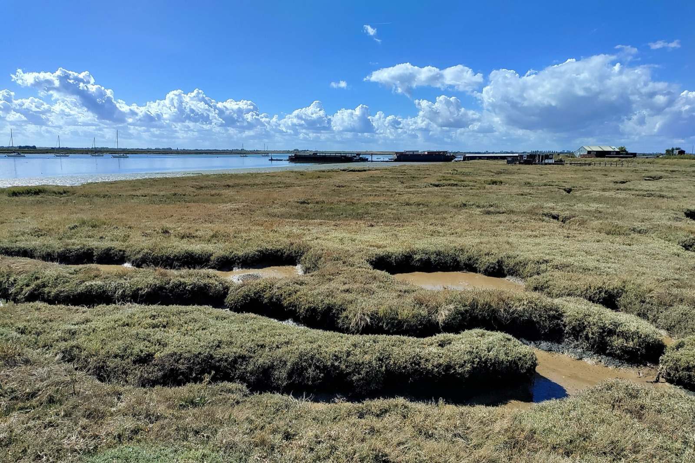
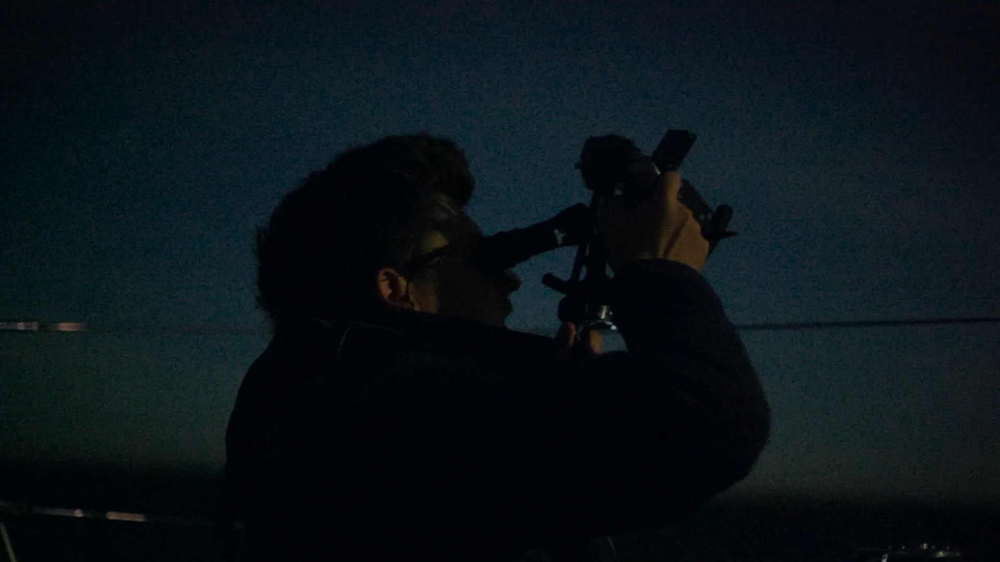
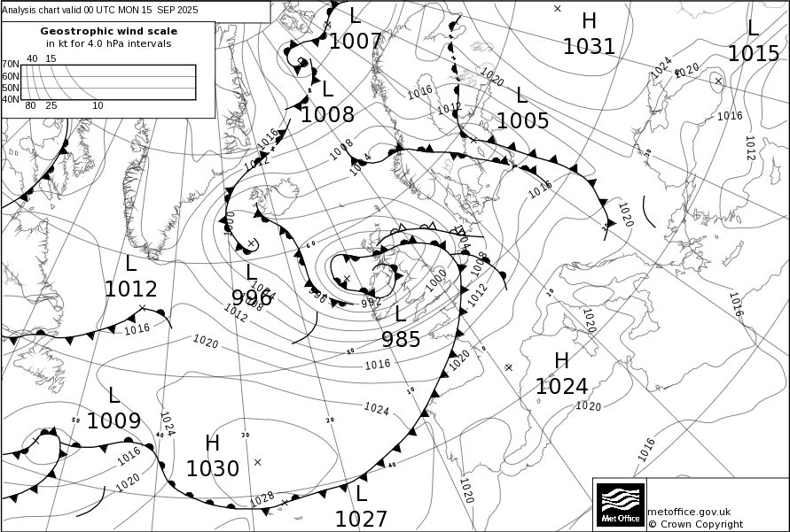

import YouTube from '../../components/YouTube.astro';

Friesland, the home of Coelacanth, greeted us with a deluge. A short walk ashore left us as sodden as if we had fallen overboard. The seasons seemed to have skipped late summer. England, a hop across the southwestern North Sea, seemed for the moment an improbable prospect.

### An Unlikely Departure

As on earlier ventures, the Frisian island of Texel would be our springboard for the crossing. From the IJsselmeer, we tacked our way against a fresh breeze, Coelacanth happy to be moving again, and arrived in the Waddenhaven. The remainder of the day was used for provisioning, and for checking the weather predictions again.

As always at spring tide, high water at Texel was conveniently located in the morning. With the ebb tide carrying us seaward, we slipped from the harbour. A small high-pressure system had developed just in time to provide us with southerly winds backing to southeast with Beaufort 5 to 6. We passed between the traffic separation scheme and a windfarm and set a southwesterly course.

<YouTube url="https://youtu.be/M6stMBbJ9Mo" />

Yet for all the heavy traffic in this corner of the North Sea, we sailed between all the freighters and container ships without the need for the slightest alteration of course – though this would not last the night. The moon was full and the sky clear down to the horizon. We were just about to cross the Deep Water Route, when we heard a nearby sailing yacht calling a freighter on the VHF radio. The sailor was requesting the freighter captain to alter course to avoid a close passing. After some back and forth spiced with threats of reporting to coastguard, the freighter briskly swerved away to starboard – which set it lumbering directly in our direction. We were forced to luff up, another freighter also had to steer clear. The original sailor, earnest defender of keeping course and speed, jolly sailed on.

The sun had risen when we turned into the Shipwash channel, the water coloured like tea with milk. Wind against tide made for a lively last twenty miles approaching Harwich. Once in River Orwell, the towering cranes of Felixstowe’s container terminal gave way to the greens and browns of the banks as we sailed upriver to Suffolk Yacht Harbour.

Twenty-seven hours after leaving Texel, we were enfolded in the lush pastures of East England’s rivers. After a hearty early dinner in the nearby Ship Inn and some tidal calculations for the next day, we slept for ten hours, peacefully dreaming of remote anchorages in East England’s rivers.

### You Cannot Anchor in the Same River Twice

The Orwell greeted us next morning with warm sunlight. Refreshed by a quiet night’s sleep, we left the harbour and passed the Landguard buoy to turn towards the south into the Wallet. Now it would prove if our tidal calculations held. We tacked our way between Spitway’s shoals letting the tide carry us gently into River Crouch. A turn into the Roach brought us to a sidearm where we dropped the anchor after several careful circles to check the depth of the muddy water.

It was spring tide and we eagerly watched the water ebb away from over six to two metres, leaving us with ample water beneath the keel to enjoy dinner in the cockpit. A man walked his dog along the riverbank, the two silhouettes dwarfed by the clouds in the big sky. We were greeted by a procession of curious seals swimming out for the night hunt for eels. Britten’s Sea Interludes played – anticipating the rising full moon painting the marshes in silver, with syncopated ripples on the shallow water. At two in the morning, at high water, I awoke to check our holding. Satisfied, I returned to the warmth of my bunk.

The following day took us upriver in the dinghy to Paglesham, where the wreck of HMS Beagle lies buried in Essex mud. Darwin’s expedition ship had sailed to the farthest reaches in search of the origin of species; she returned to her origin in the Thames estuary serving as a coastguard watch vessel to control the exuberant smuggling on these waterways.

Paglesham is named among the prettiest villages accessible to the yachtsman on the remote and strangely melancholic landscape of the East Coast rivers. We walked along the mudflats and fields, admired the Norman church, and honoured tradition with lunch at the Plough & Sail pub.

Our second night at anchor grew friskier with gusts around twenty knots downriver towards dawn. By morning we weighed anchor and sailed to Burnham-on-Crouch. Sailboats swayed around their moorings near the waterfront with several yacht clubs. Clouds gathered, and in the afternoon heavy rain fell.

<figure>

<figcaption>

Darwin’s expedition ship HMS Beagle lies buried in the marshes.

</figcaption>

</figure>

We left Burnham-on-Crouch early before dawn. On a broad reach, we passed the Walton Backwaters. We had considered entering for another anchorage but then saved them for future sailings, as the barometer was falling.

Once again, we entered River Orwell just in time for the flood carrying us upriver to the [Royal Harwich Yacht Club](https://royalharwichyachtclub.org.uk/). The club was founded in the early Victorian age under royal patronage. At that time, the club dispatched a ship northward in search of Franklin’s lost expedition to the Northwest Passage. Our Swiss fears of a lack of nobility were dispelled by a friendly welcome in the clubhouse. A delightful walk along the river led us to Pin Mill and its famous boatyard and public house.

A series of low-pressure systems approaching from the Atlantic would shape the weather of the coming week – and our sailing plans. Departure was inevitable. A storm lay west of Ireland and its front would sweep over our route in 36 hours. There was only a narrow window – we would have to depart with the afternoon tide.

### Running From a Storm

Lines were cast off after lunch on the Yacht Club’s terrace overseeing the Orwell. Our elaborate planning effort was rewarded with lightning and hail squalls soaking us just minutes after departure. We hugged the coast and watched the last cumulonimbus towers pass on the radar. The squalls had sucked all the wind away for a calm moment, but then Coelacanth accelerated and stood offshore.

The night sky was clear, and the two-hour night watches were brightened by Venus and Jupiter. The next day was sunny with cumulus clouds forming in the afternoon. We sailed on a broad reach under main and yankee sail. By then, the sky behind us was a structureless grey curtain reaching down to the horizon. We swiftly rolled a second reef into the main sail. Coelacanth smashed the crest of the waves into flying spray. Rain fell, and the wind reached thirty knots. Dutch Coastguard radioed a gale warning.

In the Schulpengat, the tidal stream turned in our favour, just as planned, and accelerated Coelacanth to almost ten knots. The tall lighthouse of Den Helder flashed his four-note rhythm guiding us into the Wadden Sea. We reached Texel in utter blackness, 170 miles and 30 hours after casting off. In fierce cross-wind we moored in the deserted Waddenhaven. The gale kept blowing for thirty-six hours with gusts up to fifty knots. We slept through the first ten hours of it.

