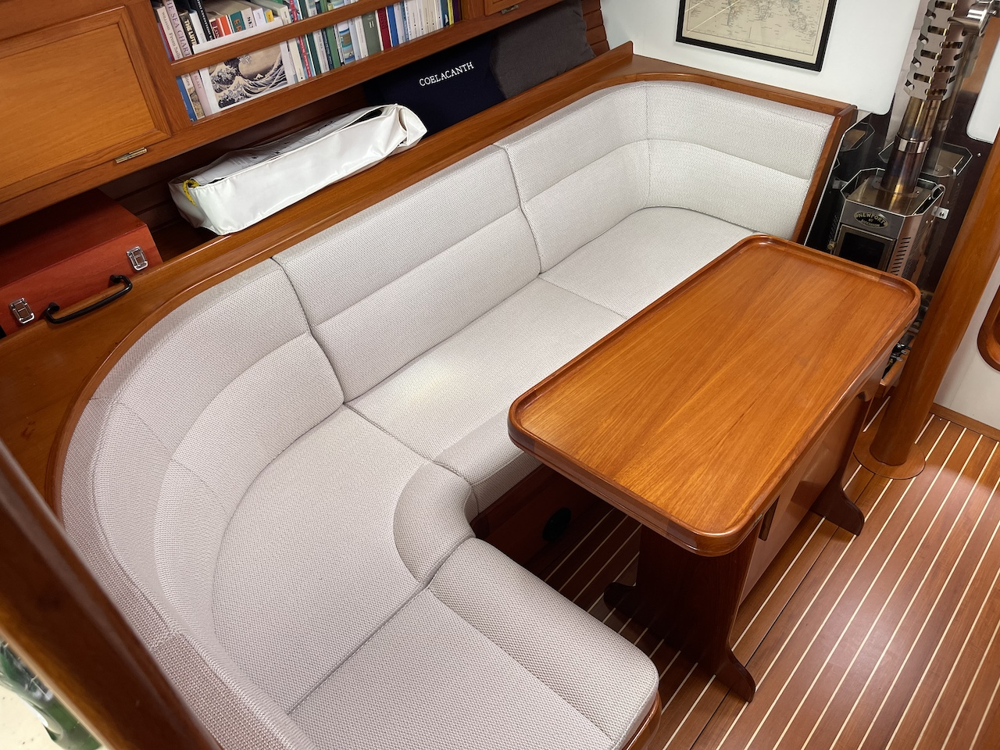
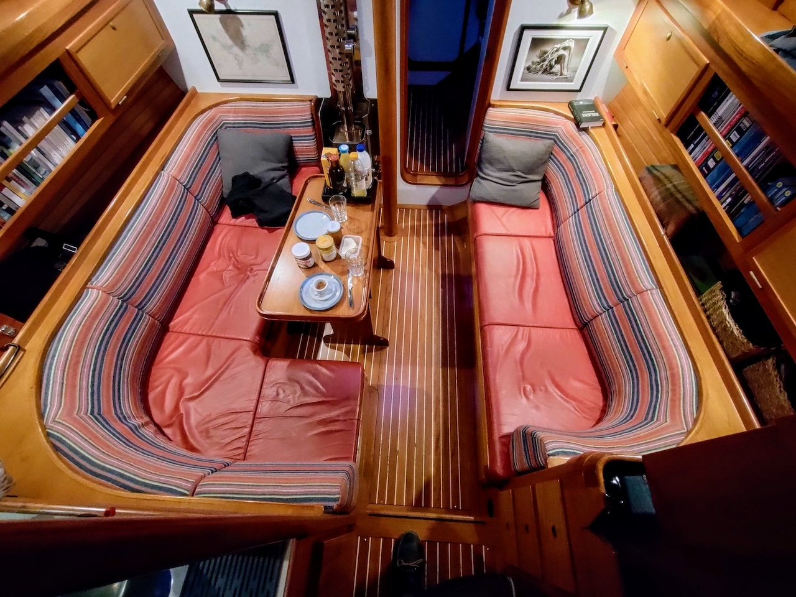
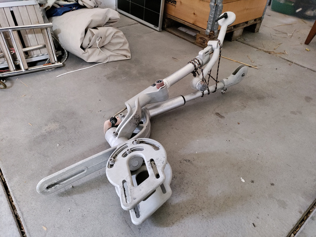

import Gallery from '../../components/Gallery.astro';

In 2025, the guys at [Hutting](https://www.hutting-yachts.com/en/) again made sure that Coelacanth continues to reach her full beauty and function. The bed mattresses and the salon upholstery were renewed by [Jaarsma & Silvius](https://jaarsmasilvius.nl/) in Frisian town Sneek which made a huge improvement in the interior atmosphere of Coelacanth. The teak warmly glows next to the fabric of the salon benches (Sunbrella Lopi Marble).

<Gallery>

</Gallery>

A 200 Watt solar panel was added that extends our energy autonomy while anchoring and proved valuable in England's rivers. Its fixed dimensions make it a bit difficult to store, however, so another foldable solar panel (Renogy 200 Watt) followed.

On the trip to the Baltic in summer, we collected the missing parts for our Windpilot Pacific windvane kindly delivered to Holtenau, where we were mooring at the lock when we returned from the Danish islands south of Funen. The windvane will lower our energy expenditure while sailing longer distances by avoiding the autopilot.

Raymarine Axiom software was updated to version LH4.9.330. As usual, I recalibrate the compass after updates.

The anchor locker was repainted to prevent corrosion of the stainless steel anchor chain. The anchor chain – that consisted of two parts welded together by the previous owner – was split in the two original parts, and only the stainless steel chain was kept (40 metres). The 80 metre-chain had piled up in the anchor locker and jammed the windlass. An anchorline (40 m, 14 mm) with lead for our light stern anchor (Fortress TX-23, 6.8 kg) was added for Scandinavian mooring on light wind days. I have to see how to best fix the stern anchor while sailing.

The toilet hose and pump were once again renewed as they were calcified again. The bilge pump was serviced.

As part of the running rigging renewal, the halyards for the stay sail (10 mm) and yankee (12 mm) are replaced with a new Spinlock clutch XTS0814/2 at the mast. Also, the spinnaker halyard for the ordered gennaker is getting replaced. The gennaker will help keep Coelacanth moving on days with light wind – which we didn't experience too often so far on the North Sea…
