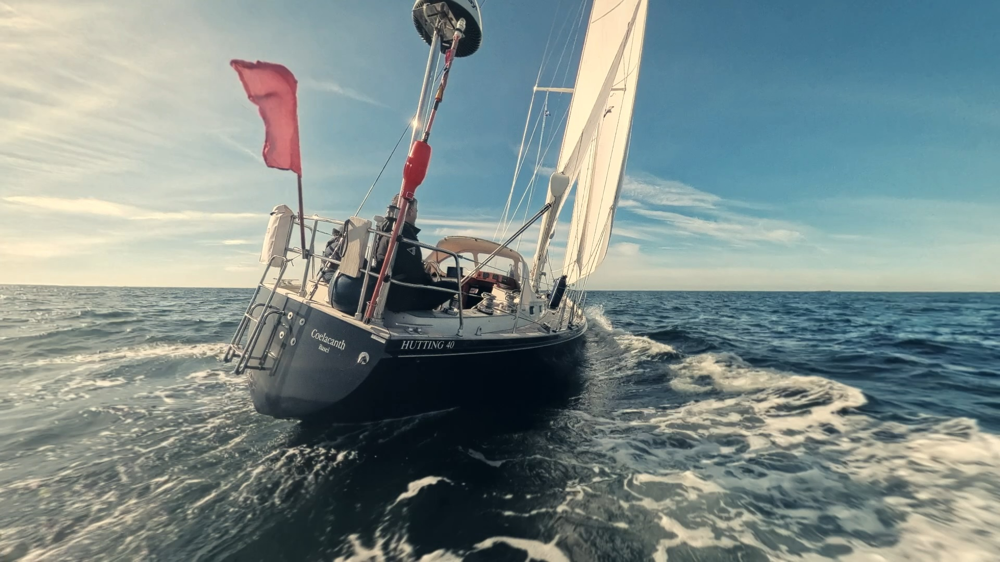

## The Ship
Coelacanth is a Hutting 40 full-keeler built in 2001 by [Frisian Hutting Yachts](https://www.hutting-yachts.com/en/). The name Coelacanth goes back to the 400-million-year-old “living fossil” fish thought to be extinct, but rediscovered off the coast of South Africa in 1938.

